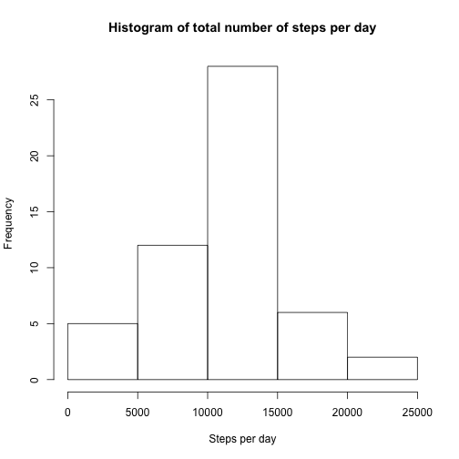

Reproducible Research 1
=======================

Human Activity Recognition Using Smartphones Data Set 

Author: Thomas Berger (https://github.com/bergertom/ReproducibleResearch1.git)

This analysis was generated on 2016-02-02 18:29:55 by running the script ``run_PA1_template.R``.


1. Load and preprocess the data
-------------------------------

```r
# read the data
raw_data <- data.frame(read.csv(datafile))

# For this part of the assignment, you can ignore the missing values in the dataset.
clean_data <- na.omit(raw_data)
```

2. Calculate the total number of steps per day
----------------------------------------------


```r
# Calculate the total number of steps taken per day
steps_per_day <- aggregate(clean_data[,"steps"], by=list(clean_data$date), "sum")
colnames(steps_per_day) <- c("date","steps")

# Make a histogram of the total number of steps taken each day
hist(steps_per_day$steps, main = "Histogram of total number of steps per day", xlab = "Steps per day")
```

 
 
3. Calculate and the mean and median number of steps taken per day
------------------------------------------------------------------

Calculate and report the mean and median of the total number of steps taken per day


```r
# calculate mean steps per day
round(mean(steps_per_day$steps))
```

```
## [1] 10766
```

```r
# calculate median steps per day
median(steps_per_day$steps)
```

```
## [1] 10765
```

The mean number steps are 10766 and the median 10765 of the total number of steps taken per day.

4. Make a time series plot of the interval, across all days
-----------------------------------------------------------

Make a time series plot of the interval, using average number of steps taken, across all days


```r
# aggregate average number of steps by interval
steps_by_interval <- aggregate(steps ~ interval, clean_data, mean)

# Make a time series plot (i.e. 𝚝𝚢𝚙𝚎 = "𝚕") of the 5-minute interval (x-axis)
# and the average number of steps taken, averaged across all days (y-axis)
plot(steps_by_interval$interval,steps_by_interval$steps, type="l", xlab="Interval", ylab=
         "Number of Steps",main="Average Number of Steps per Day by Interval")
```

 

Which 5-minute interval, on average across all the days in the dataset, contains the maximum number of steps?

```r
steps_by_interval[which.max(steps_by_interval$steps),"interval"]
```

```
## [1] 835
```
The 5-minute interval containing the maximum number of steps, 
on average across all the days in the data set, is 835.

4. Imputing missing values
--------------------------

Note Impute missing values and compare to original data.

that there are a number of days/intervals where there are missing values (coded as 𝙽𝙰). The presence of missing days may introduce bias into some calculations or summaries of the data.

5. Calculate and report the total number of missing values in the dataset (i.e. the total number of rows with 𝙽𝙰s)
Devise a strategy for filling in all of the missing values in the dataset. The strategy does not need to be sophisticated. For example, you could use the mean/median for that day, or the mean for that 5-minute interval, etc.


(1) X-axis is the 5 minute intervals 05, 10, 15...105, 110, 115...2305, 2310..2355. Y axis is the average no. of steps taken in each interval where the average is taken across all 70 (or whatever) instances of that interval across all days in the sample.

(2) Of the 5 minute intervals shown in (1) which one has the highest no. of steps (averaged across all 70 (or whatever) days).


6. Create a new dataset that is equal to the original dataset but with the missing data filled in.

7. Make a histogram of the total number of steps taken each day and Calculate and report the mean and median total number of steps taken per day. Do these values differ from the estimates from the first part of the assignment? What is the impact of imputing missing data on the estimates of the total daily number of steps?
Are there differences in activity patterns between weekdays and weekends?

For this part the 𝚠𝚎𝚎𝚔𝚍𝚊𝚢𝚜() function may be of some help here. Use the dataset with the filled-in missing values for this part.


8. Create a new 5. Differences in weekdays and weekends
---------------------------------------
factor variable in the dataset with two levels – “weekday” and “weekend” indicating whether a given date is a weekday or weekend day.
Make a panel plot containing a time series plot (i.e. 𝚝𝚢𝚙𝚎 = "𝚕") of the 5-minute interval (x-axis) and the average number of steps taken, averaged across all weekday days or weekend days (y-axis). See the README file in the GitHub repository to see an example of what this plot should look like using simulated data.

